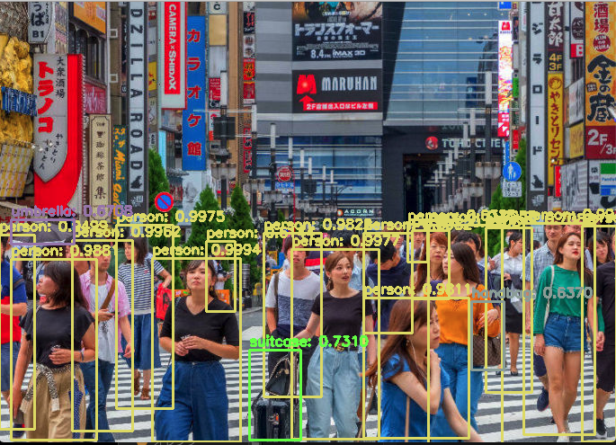

# YOLO(You Only Look Once), Object Detection

**Version 1.0.0**

YOLO is a real-time object detection system. 
These python codes present object detection in static images, videos, and real-time as well.
To enhance accuracy and efficiency, I used pre-trained model provided by [darknet](https://github.com/pjreddie/darknet).
This enables me to train images even on my old mac book.


## How to Use it

```
	
	git clone https://github.com/koki1610168/YOLO-object-detection.git

```

* Add an input image into the images folder or a clip into the videos.

```

	python image.py --input videos/____ --yolo yolo-coco

```

**This will give you something like this**




